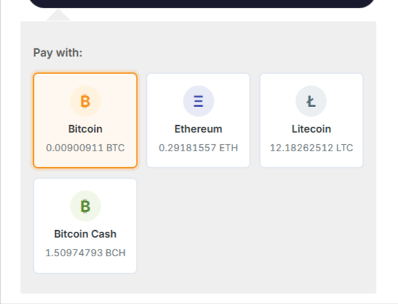
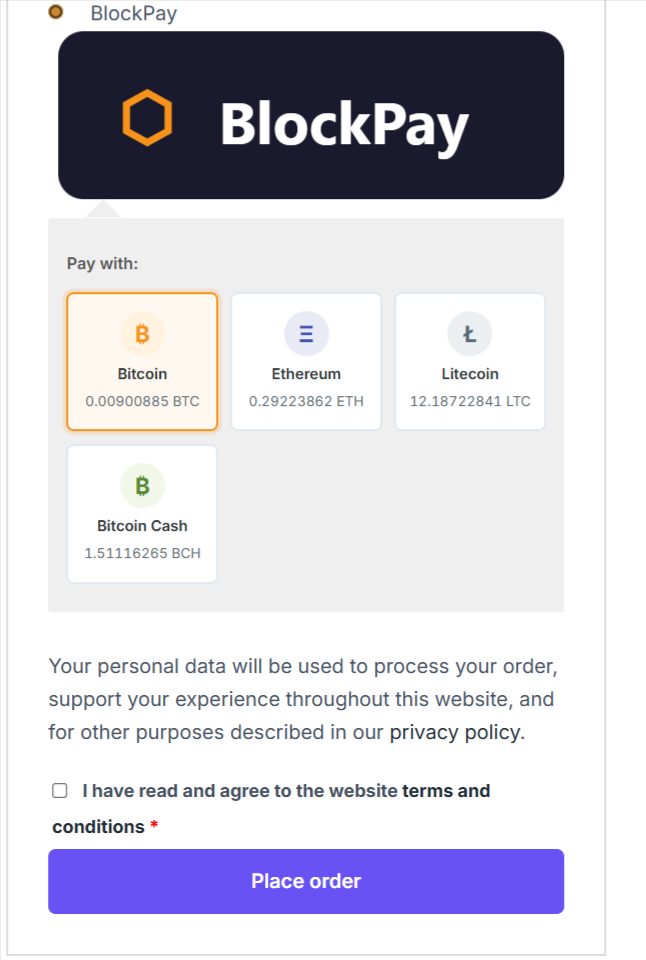
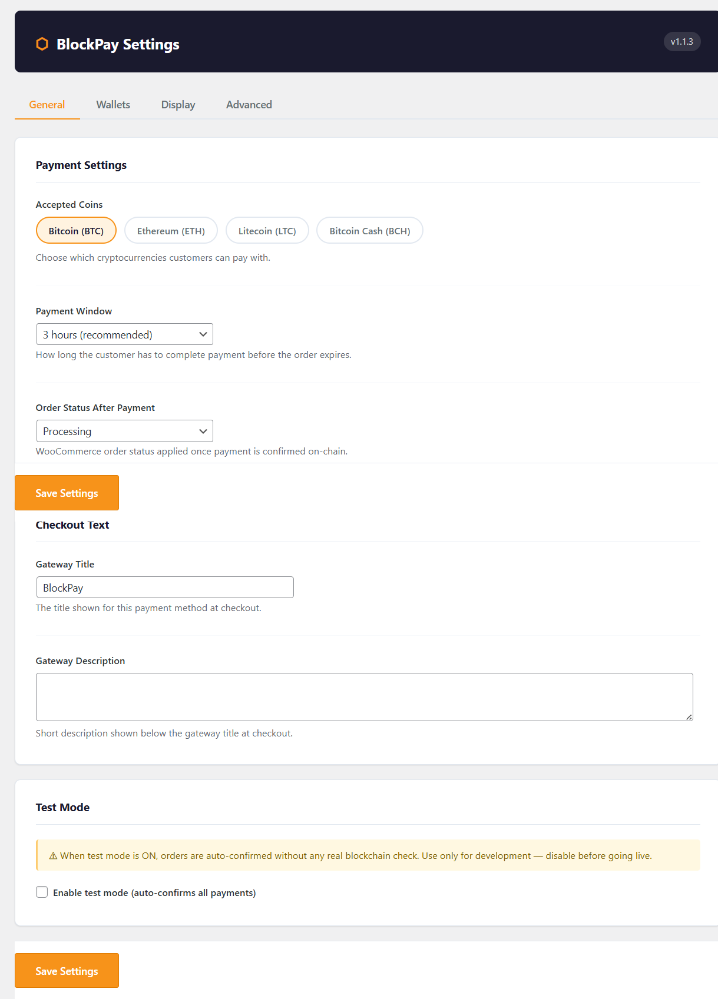
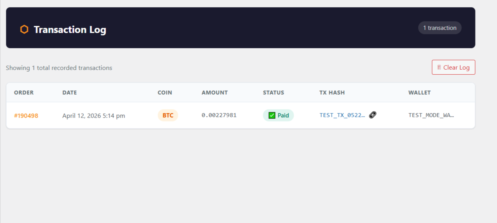
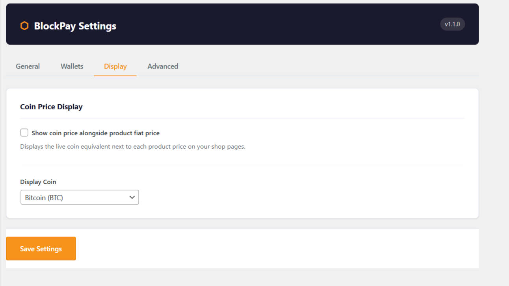
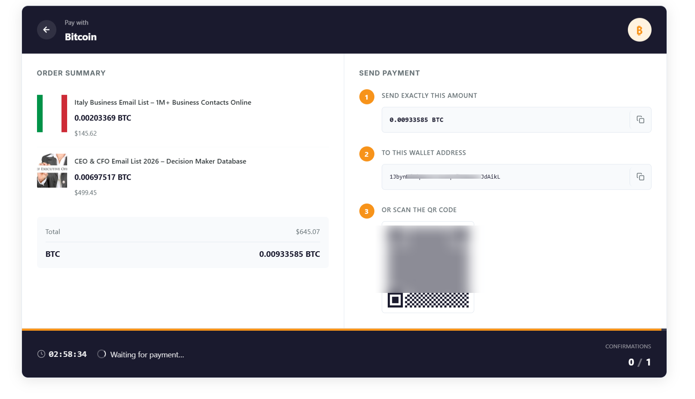

<div align="center">


# BlockPay — Crypto Payment Gateway for WordPress & WooCommerce

**Accept Bitcoin, Ethereum, Litecoin and Bitcoin Cash payments directly in your WooCommerce store.**
No payment processors. No monthly fees. No commissions. Funds go straight to your wallet.

[](https://wordpress.org)
[](https://woocommerce.com)
[](https://php.net)
[](LICENSE.txt)
[](CHANGELOG.md)

[✨ Features](#-features) · [📸 Screenshots](#-screenshots) · [⚡ Quick Start](#-quick-start) · [📖 Documentation](#-documentation) · [🤝 Contributing](#-contributing)

---

**🔥 The only 100% free, self-hosted crypto payment plugin with no hidden fees, no API keys required, and funds that go directly to YOUR wallet.**

</div>

---

## 📖 Table of Contents

- [Why BlockPay?](#-why-blockpay)
- [Features](#-features)
- [Supported Cryptocurrencies](#-supported-cryptocurrencies)
- [Screenshots](#-screenshots)
- [Quick Start](#-quick-start)
- [Requirements](#-requirements)
- [Installation](#-installation)
- [Configuration](#-configuration)
- [How It Works](#-how-it-works)
- [Developer Hooks](#-developer-hooks)
- [FAQ](#-faq)
- [Comparison](#-comparison-blockpay-vs-alternatives)
- [Roadmap](#-roadmap)
- [Contributing](#-contributing)
- [License](#-license)

---

## 💡 Why BlockPay?

Most crypto payment plugins for WordPress require you to:
- ❌ Sign up with a third-party payment processor
- ❌ Pay monthly fees or per-transaction commissions
- ❌ Wait days for payouts to your bank
- ❌ Share customer data with external services
- ❌ Trust a middleman with your revenue

**BlockPay is different.**

- ✅ **100% peer-to-peer** — payments go wallet-to-wallet with no intermediary
- ✅ **Zero fees** — the only cost is the blockchain network fee paid by the customer
- ✅ **Instant settlement** — funds arrive in your wallet as soon as the transaction confirms
- ✅ **No account needed** — just add your wallet addresses and go
- ✅ **Open source** — GPL v2, audit the code yourself
- ✅ **Self-hosted** — your data stays on your server

---

## ✨ Features

### 💳 Payment Processing
- Accept **Bitcoin (BTC)**, **Ethereum (ETH)**, **Litecoin (LTC)** and **Bitcoin Cash (BCH)**
- Real-time blockchain transaction verification
- Live countdown timer on payment page
- QR code generation (client-side, no external service)
- Copy-to-clipboard for wallet address and amount
- Configurable payment window (1–24 hours)
- Automatic order cancellation on expiry with stock release
- Partial payment tolerance (0.5%) for network fee edge cases

### 💰 Pricing & Conversion
- Live coin prices via **CoinGecko API** (free, no key required)
- Supports **every WooCommerce currency** (USD, EUR, GBP, INR, AUD, and 100+ more)
- Per-currency price caching — no stale rates for multi-currency stores
- Display coin prices alongside fiat prices on product pages
- Unique per-order amount generation to prevent transaction conflicts

### 🔒 Security
- Nonce verification on all AJAX requests and forms
- All inputs sanitized, all outputs escaped
- Duplicate transaction detection and prevention
- Round-robin wallet rotation (no address reuse across orders)
- No sensitive data stored in plaintext

### 📧 Notifications
- Customer email on payment confirmation (uses WooCommerce email templates)
- Payment reminder email 30 minutes before window expires
- Full order notes on every payment event
- Customisable email subject and heading from WC settings

### 📊 Admin & Reporting
- **Dashboard widget** with today's stats (paid, pending, expired, revenue)
- **Transaction log** with blockchain explorer links
- **CSV export** of all transactions (Excel-compatible)
- WooCommerce order metabox showing all payment details
- Settings saved feedback with test mode status indicator

### 🧰 Developer Friendly
- Action hooks for all payment events (`blockpay_payment_confirmed`, `_expired`, `_failed`, `_pending`)
- Filter to modify coin amounts (`blockpay_coin_amount`)
- Abstract base coin class — add new coins in minutes
- WooCommerce HPOS (High Performance Order Storage) compatible
- No third-party framework dependencies (no Redux, no TGMPA)
- Clean `uninstall.php` removes all plugin data on deletion

### 🧪 Development
- Built-in **test mode** — auto-confirms orders without real blockchain checks
- Detailed order notes for debugging
- Per-currency price cache for accurate multi-currency testing

---

## 🪙 Supported Cryptocurrencies

| Coin | Ticker | Network | Explorer |
|------|--------|---------|----------|
| Bitcoin | BTC | Bitcoin Mainnet | [blockchain.com](https://blockchain.com/btc) |
| Ethereum | ETH | Ethereum Mainnet | [etherscan.io](https://etherscan.io) |
| Litecoin | LTC | Litecoin Mainnet | [blockcypher.com](https://live.blockcypher.com/ltc) |
| Bitcoin Cash | BCH | Bitcoin Cash Mainnet | [blockchain.com](https://blockchain.com/bch) |

> 💡 All coins use the free [Blockcypher API](https://www.blockcypher.com/) for transaction verification — no API key required.

---

## 📸 Screenshots

| Checkout Coin Selector | Payment Paybox | Admin Settings |
|------------------------|---------------|----------------|
|  |  |  |

| Transaction Log | Dashboard Widget | Order Metabox |
|----------------|-----------------|---------------|
|  |  |  |

---

## ⚡ Quick Start

```bash
# 1. Download the latest release
# Go to Releases → download blockpay-vX.X.X.zip

# 2. Install in WordPress
# WordPress Admin → Plugins → Add New → Upload Plugin

# 3. Add your wallet addresses
# BlockPay → Settings → Wallets

# 4. Enable the gateway
# WooCommerce → Settings → Payments → BlockPay → Enable

# 5. Done — start accepting crypto! 🚀
```

---

## 📋 Requirements

| Requirement | Minimum Version |
|-------------|----------------|
| WordPress | 5.8+ |
| WooCommerce | 5.0+ |
| PHP | 7.4+ |
| MySQL | 5.6+ |

**No other plugins required.** BlockPay uses the native WordPress Settings API and WooCommerce payment gateway API — no Redux Framework, no extra dependencies.

---

## 📥 Installation

### Option A — Via WordPress Admin (Recommended)

1. Go to **Plugins → Add New → Upload Plugin**
2. Upload `blockpay.zip`
3. Click **Activate**

### Option B — Via FTP

1. Download and unzip `blockpay.zip`
2. Upload the `blockpay` folder to `/wp-content/plugins/`
3. Activate from **Plugins → Installed Plugins**

### Option C — Via WP-CLI

```bash
wp plugin install blockpay.zip --activate
```

---

## ⚙️ Configuration

### Step 1 — Add Wallet Addresses

Go to **BlockPay → Settings → Wallets**

Add your receiving addresses for each coin (one per line).

```
# Example BTC wallets
1A2b3CdEfGhIjKlMnOpQrStUvWxYz123456
1BvBMSEYstWetqTFn5Au4m4GFg7xJaNVN2
1DbkFHtbDgwFovCyb7XGmCkWrSVGETHCNx
```

> 💡 Add **10–20 addresses per coin** for best results. BlockPay rotates through them in sequence so the same address is never used twice in a row.

### Step 2 — Configure General Settings

Go to **BlockPay → Settings → General**

| Setting | Recommended |
|---------|-------------|
| Payment Window | 3 hours |
| Order Status After Payment | Processing |
| Gateway Title | BlockPay |

### Step 3 — Enable in WooCommerce

Go to **WooCommerce → Settings → Payments**

Find BlockPay and click **Enable**.

### Step 4 — Test

Enable **Test Mode** in BlockPay Settings and place a test order. The payment will auto-confirm within 20 seconds. Disable test mode before going live.

---

## 🔄 How It Works

```
Customer selects coin at checkout
           ↓
Order created → BlockPay assigns a wallet address and calculates coin amount
           ↓
Customer is redirected to the payment page
           ↓
Customer sends exact coin amount to displayed wallet address
           ↓
BlockPay polls Blockcypher every 20 seconds to detect the transaction
           ↓
Transaction found + confirmed on blockchain
           ↓
Order status updated → Customer email sent → Funds in your wallet ✅
```

### Payment Window

Customers have a configurable window (default 3 hours) to complete payment. If no transaction is received within the window:

- Order is automatically cancelled
- Stock is released back to inventory
- Customer receives no charge (crypto was never sent)

### Wallet Rotation

BlockPay uses **round-robin rotation** across your configured wallet addresses. This means:
- Every order gets a different wallet address
- Addresses are reused only after all others have been used once
- Makes it easier to track which payment came from which order

---

## 🔗 Developer Hooks

BlockPay exposes action hooks and filters so you can extend functionality without modifying core files.

### Action Hooks

```php
// Fires when payment is confirmed on-chain
add_action( 'blockpay_payment_confirmed', function( $order_id, $coin, $amount, $tx_hash ) {
    // Send Slack notification, update CRM, trigger fulfillment, etc.
    error_log( "BlockPay: Order #{$order_id} paid {$amount} {$coin}. TX: {$tx_hash}" );
}, 10, 4 );

// Fires when payment window expires
add_action( 'blockpay_payment_expired', function( $order_id, $coin ) {
    // Log, notify admin, trigger re-marketing, etc.
}, 10, 2 );

// Fires when payment verification fails
add_action( 'blockpay_payment_failed', function( $order_id, $coin ) {
    // Handle failed payment
}, 10, 2 );

// Fires when a new payment session is created
add_action( 'blockpay_payment_pending', function( $order_id, $coin, $amount, $wallet, $expire_ts ) {
    // Log payment session, notify team, etc.
}, 10, 5 );
```

### Filters

```php
// Modify the coin amount before it is stored on the order
// Useful for adding a small buffer or applying a discount
add_filter( 'blockpay_coin_amount', function( $amount, $coin, $fiat_total, $order_id ) {
    // Example: add 1% buffer to prevent partial payment issues
    return number_format( (float) $amount * 1.01, 8, '.', '' );
}, 10, 4 );
```

### Adding a Custom Coin

Extend the abstract `BlockPay_Coin` class:

```php
class BlockPay_Coin_Doge extends BlockPay_Coin {

    public function get_ticker() {
        return 'DOGE';
    }

    protected function find_transaction( array $body ) {
        $txs      = BlockPay_API_Client::extract_txs( $body );
        $expected = $this->normalize_amount( $this->expected_amount );

        foreach ( $txs as $tx ) {
            foreach ( $tx['outputs'] as $output ) {
                if ( ! in_array( $this->wallet, $output['addresses'], true ) ) continue;
                $received = $this->from_smallest_unit( $output['value'], 8 );
                if ( $this->amounts_match( $received, $expected ) ) {
                    return array(
                        'tx_hash'       => $tx['hash'],
                        'confirmations' => (int) $tx['confirmations'],
                    );
                }
            }
        }
        return null;
    }
}
```

---

## ❓ FAQ

<details>
<summary><strong>Do I need to sign up for anything?</strong></summary>

No. BlockPay works entirely with your own wallet addresses. No accounts, no API keys, no third-party sign-ups required.

</details>

<details>
<summary><strong>Which WooCommerce currencies are supported?</strong></summary>

All of them. BlockPay uses CoinGecko to convert from any fiat currency to coin amounts. USD, EUR, GBP, INR, AUD, JPY, CAD and 100+ others all work out of the box.

</details>

<details>
<summary><strong>Is there a transaction fee?</strong></summary>

BlockPay itself charges zero fees. The only cost is the blockchain network fee (gas fee) which is paid by the customer when they send the transaction — this never touches you.

</details>

<details>
<summary><strong>What happens if a customer pays too late?</strong></summary>

The payment window expires (default: 3 hours), the order is automatically cancelled, and stock is released back to inventory. The customer receives no charge since they never sent any crypto.

</details>

<details>
<summary><strong>What if a customer sends slightly less than the required amount?</strong></summary>

BlockPay includes a 0.5% tolerance for underpayment to handle cases where network fees are deducted from the sent amount. Payments within 0.5% of the required amount are accepted.

</details>

<details>
<summary><strong>Can I use BlockPay with a multi-currency plugin?</strong></summary>

Yes. BlockPay caches prices per currency, so if your store switches between USD and EUR the correct conversion rates are always used for each currency independently.

</details>

<details>
<summary><strong>Is BlockPay compatible with WooCommerce HPOS?</strong></summary>

Yes. BlockPay explicitly declares compatibility with WooCommerce High Performance Order Storage (custom order tables).

</details>

<details>
<summary><strong>How many wallet addresses should I add?</strong></summary>

We recommend 10–20 per coin. BlockPay rotates through them in sequence, so having more addresses means less chance of the same address appearing on two orders simultaneously (which could confuse payment detection).

</details>

<details>
<summary><strong>Can I add coins beyond BTC, ETH, LTC, BCH?</strong></summary>

Yes — BlockPay is built with an abstract `BlockPay_Coin` base class specifically designed for extension. See the [Developer Hooks](#developer-hooks) section for an example of adding Dogecoin.

</details>

<details>
<summary><strong>Is BlockPay secure?</strong></summary>

BlockPay follows WordPress security best practices: all inputs are sanitized, all outputs are escaped, all AJAX requests are protected with nonces, and duplicate transaction detection prevents payment replay attacks. The code is fully open source and auditable.

</details>

<details>
<summary><strong>Does BlockPay work with WooCommerce Subscriptions?</strong></summary>

Not currently. Crypto payments don't support recurring/subscription billing by nature — each payment is a one-time manual transaction. BlockPay works with standard one-off product purchases.

</details>

---

## ⚖️ Comparison: BlockPay vs Alternatives

| Feature | BlockPay | CoinPayments | BitPay | NOWPayments |
|---------|----------|-------------|--------|-------------|
| Monthly fee | **Free** | Free / $9.99 | $0–$3,000/mo | Free / $0.5% |
| Transaction fee | **0%** | 0.5% | 1% | 0.5% |
| Funds go to | **Your wallet direct** | Their platform | Their platform | Their platform |
| API key required | **No** | Yes | Yes | Yes |
| Open source | **Yes (GPL v2)** | No | No | No |
| Self-hosted | **Yes** | No | No | No |
| WooCommerce native | **Yes** | Plugin | Plugin | Plugin |
| BTC support | ✅ | ✅ | ✅ | ✅ |
| ETH support | ✅ | ✅ | ✅ | ✅ |
| LTC support | ✅ | ✅ | ✅ | ✅ |
| BCH support | ✅ | ✅ | ❌ | ✅ |
| Test mode | ✅ | ✅ | ✅ | ✅ |
| HPOS compatible | ✅ | ❌ | ❌ | ❌ |

---

## 🗺️ Roadmap

### v1.3.0 ✅ Current
- [x] BTC, ETH, LTC, BCH support
- [x] Real-time transaction verification
- [x] Admin dashboard widget
- [x] CSV transaction export
- [x] Developer webhook hooks
- [x] Multi-currency price caching
- [x] Payment reminder email
- [x] Test mode

### v1.4.0 — Planned
- [ ] USDT (ERC-20) support
- [ ] Dogecoin (DOGE) support
- [ ] Solana (SOL) support
- [ ] Admin analytics charts
- [ ] Slack / Discord webhook notifications
- [ ] WooCommerce Blocks checkout support

### v2.0.0 — Future
- [ ] PRO license system
- [ ] Multi-store management dashboard
- [ ] Custom confirmation threshold per coin
- [ ] Webhook delivery log
- [ ] REST API endpoints

---

## 🏗️ Architecture

```
blockpay/
├── blockpay.php                         # Bootstrap, constants, autoloader
├── uninstall.php                        # Clean DB removal on delete
│
├── includes/
│   ├── class-blockpay-loader.php        # Singleton — all hooks registered here
│   ├── class-blockpay-activator.php     # Activation / deactivation
│   ├── class-blockpay-settings.php      # Settings wrapper (get_option)
│   ├── class-blockpay-price-feed.php    # CoinGecko prices + transient cache
│   ├── class-blockpay-api-client.php    # Blockcypher HTTP client (429 retry)
│   ├── class-blockpay-order.php         # Order meta, wallet rotation, status
│   ├── class-blockpay-ajax.php          # AJAX: tx checker endpoint
│   ├── class-blockpay-cron.php          # WP-Cron: price refresh + order sweep
│   ├── class-blockpay-gateway.php       # WooCommerce payment gateway
│   ├── class-blockpay-email-reminder.php # WC email: payment reminder
│   └── class-blockpay-dashboard-widget.php # WP dashboard widget
│
├── coins/
│   ├── abstract-blockpay-coin.php       # Base class — extend to add new coins
│   ├── class-blockpay-coin-btc.php
│   ├── class-blockpay-coin-eth.php
│   ├── class-blockpay-coin-ltc.php
│   └── class-blockpay-coin-bch.php
│
├── admin/
│   ├── class-blockpay-admin.php         # Admin menu, settings pages, CSV export
│   └── views/
│       ├── page-settings.php            # Tabbed settings UI
│       └── page-tx-log.php              # Transaction log + CSV export
│
├── templates/
│   ├── payment.php                      # Paybox template (order-pay step)
│   └── emails/
│       ├── blockpay-reminder.php        # HTML reminder email
│       └── plain/blockpay-reminder.php  # Plain text reminder email
│
└── assets/
    ├── css/blockpay.css                 # Frontend styles (responsive)
    ├── js/blockpay.js                   # Payment polling engine
    └── images/blockpay-logo.svg
```

---

## 🤝 Contributing

Contributions are welcome! Here's how:

```bash
# 1. Fork the repository
# 2. Clone your fork
git clone https://github.com/YOUR-USERNAME/blockpay.git
cd blockpay

# 3. Create a feature branch
git checkout -b feature/add-dogecoin-support

# 4. Make your changes
# Follow WordPress Coding Standards
# https://developer.wordpress.org/coding-standards/

# 5. Test thoroughly
# Enable WP_DEBUG and check for errors
# Test with WooCommerce test mode

# 6. Submit a pull request
```

### Coding Standards

- Follow [WordPress PHP Coding Standards](https://developer.wordpress.org/coding-standards/wordpress-coding-standards/php/)
- All inputs must be sanitized with `sanitize_*` functions
- All outputs must be escaped with `esc_*` functions
- All AJAX handlers must verify nonces
- New coin classes must extend `BlockPay_Coin`

### Reporting Issues

Found a bug? [Open an issue](https://github.com/YOUR-USERNAME/blockpay/issues) with:
- WordPress version
- WooCommerce version
- PHP version
- Steps to reproduce
- Expected vs actual behaviour

---

## 📄 Changelog

See [CHANGELOG.md](CHANGELOG.md) for full version history.

### v1.3.0
- Added: Admin dashboard widget with real-time stats
- Added: CSV export for transaction log
- Added: Developer action hooks (`blockpay_payment_confirmed`, `_expired`, `_failed`, `_pending`)
- Added: `blockpay_coin_amount` filter for custom coin amount modification
- Fixed: Multi-currency price cache now per-currency (no stale rates)

### v1.2.0
- Added: Payment reminder email (30 min before window expires)
- Added: Configurable email subject/heading in WC email settings
- Added: Plain text email fallback

### v1.1.x
- Fixed: WooCommerce hard dependency guard
- Fixed: `blockpay_coin` POST field whitelisted through WC checkout
- Fixed: Blockcypher HTTP 429 retry logic
- Fixed: ETH address case-insensitive comparison
- Fixed: QR code now generated client-side (qrcode.js)
- Fixed: Customer email on payment confirmation
- Added: Test mode with admin feedback
- Added: Order notes on all payment events
- Fixed: Stock released on expiry and failure
- Added: `readme.txt` for WordPress.org

### v1.0.0
- Initial release

---

## 📜 License

BlockPay is licensed under the [GNU General Public License v2.0](LICENSE.txt) or later.

```
BlockPay — Crypto Payment Gateway for WordPress & WooCommerce
Copyright (C) 2024 BlockPay

This program is free software; you can redistribute it and/or modify
it under the terms of the GNU General Public License as published by
the Free Software Foundation; either version 2 of the License, or
(at your option) any later version.
```

---

## 🙏 Credits

BlockPay uses the following free, open-source services and libraries:

| Service / Library | Purpose | License |
|---|---|---|
| [CoinGecko API](https://www.coingecko.com/en/api) | Live cryptocurrency prices | Free public API |
| [Blockcypher API](https://www.blockcypher.com/) | Blockchain transaction lookup | Free tier |
| [qrcode.js](https://github.com/davidshimjs/qrcodejs) | Client-side QR code generation | MIT |
| [WooCommerce](https://woocommerce.com/) | E-commerce platform | GPL v3 |

---

<div align="center">

**Built with ❤️ for the WordPress community**

[⭐ Star this repo](https://github.com/raja-koppula/blockpay) · [🐛 Report a bug](https://github.com/raja-koppula/blockpay/issues) · [💡 Request a feature](https://github.com/raja-koppula/blockpay/issues)

</div>
